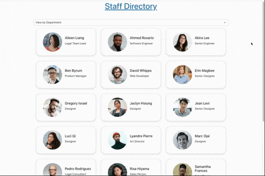

# Employee Directory

View the live deployment of [Employee Directory](https://joe-zu.github.io/19-EmployeeDirectory/)

## Introduction

Employee Directory or staffdir, is a small React app to organize and view employees. This app utilizes the "useState" hook to manage the state, which filters the employees. 

## Usage 

By default, the app's employees are populated by a json file. But it can easily be configured to load employees from a remote database. 

## Installation

Clone the repository, load your own employees, or use the code in whatever way you wish. 

## Thank you
photos from [Unsplash](https://unsplash.com/)